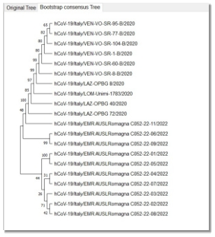
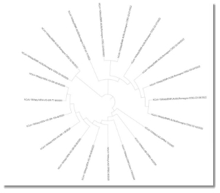
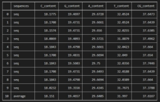



**Comparative study for SARS-Cov-2 (COVID-19) and its variant Omicron**

Ashar Seif Al-Nasr1, a, Alaa-Allah Essam1, a, Aya Abdullah Farag1, a, and Walaa Salah1, a

1 Biomedical Engineering and Systems, Faculty of Engineering, Cairo University, Giza, Egypt

`  `Correspondence to: Dr. Ibrahim Mohamed Youssef, PhD

a Authors contributed equally to this manuscript.

***Abstract*— In this paper, we are examining the similarities and differences between COVID-19 and its variant Omicron .The analysis approach used to apply this comparison includes construction of a consensus sequence for ten sequences of COVID-19 virus, named reference sequence, and applying multiple sequence alignment to ten sequences of COVID-19 Omicron variant, named case sequences, all the sequences were obtained from Italy. The biological comparison also includes   construction of a phylogenetic tree, calculation of an average percentage of the chemical constituents (C, G, T, and A), obtaining the CG content and extraction of the dissimilar regions between the aligned omicron sequences and the consensus sequence. The results of the comparison show that there are indeed similarities between the two variants.**

***Keywords*— SARS-COV-2, COVID-19, and Omicron.**
## INTRODUCTION
Since the start of SARS-COV-2 (COVID-19) virus pandemic era, the virus has undergone multiple mutations as it spreads across countries worldwide. One of the latest discovered variant to COVID-19 is Omicron which was first discovered in Botswana and South Africa and has a high spreading rate puts it on top of the danger scale. The multiple SARS variants forced the scientific society to utilize different scientific techniques to differentiate between these different variants trying to predict the current and the future behavior of the virus. Bioinformatics applies tools of computation and analysis to the capture and interpretation of biological data. Thus, in this paper we use some of bioinformatics techniques such as sequence alignment and phylogenetic trees to differentiate between COVID-19 and its variant Omicron in terms of genetics trying to capture a general idea on the apparent changes between COVID-19 and Omicron. Ten COVID-19 sequences and ten Omicron sequences, collected data from Italy which badly suffered from Covid since 2019, were used to apply the analysis approach in this study. 

##  Materials and Methods
## *A. Data Collection* 
The data was collected from the GISAID (Global Initiative on Sharing All Influenza Data) which is a public database for SARS-Cov-2 sequences and its variants. It is a collaborative work between the German government and a non-profit organization (Friends of GISAID).Ten files was downloaded for each SARS type containing COVID-19 and its variant Omicron, each file contains one DNA sequence .All data was from Italy containing both genders with different ages and different disease danger scale and symptoms. 

## *B. Data preprocessing*  
1. **Consensus sequences**: 

The Covid file was read to find out the length and determine the nucleotides G, T, A, C, Gaps and a nucleotide whose type was unknown (N). Doing iteration on every single nucleotide to make profile matrix to determine number of repetitions of each nucleotide, at each sequence location, the nucleotide/amino acid of the consensus sequence will be the most dominant one across all the sequences at that location. This method is for genetic purposes and the biologists themselves choose a certain threshold determining if the nucleotide is dominant or not to construct the final consensus sequence. The purpose is to find the optimal binding site for transcription. But in here we did

not pick any threshold as we have limited sequences so, the threshold will not be required to prove anything as in the end it is the biologist decision.    

2. **Multiple Sequence Alignment:**

This step is required in several steps, we applied all alignments using MEGA software to find regions of similarity between several sequences, first alignment is done on the original data separately, and each 10 sequences are aligned together. Moreover, another alignment is between the consensus sequence and the aligned omicron data. Regarding the phylogenetic tree, all 20 sequences were aligned together before generating the tree.  

## *C. Phylogenetic tree*

A phylogenetic tree is a graphical representation of the evolutionary relationships between biological entities, usually sequences or species. Relationships between entities are captured by the topology (branching order) and amount of evolutionary change (branch lengths) between nodes.  In this study we choose neighbor joining test to construct the tree and presented it in different layouts including rectangular and circular.
## *D. Average percentage:*
The average percentage of the chemical constituents (C, G, T, and A) and the CG content of Case sequences. First, initial the sum of the chemical constituents by zeros.Then, count its exit in the sequence to calculate the average. Using built-in function (count) to calculate number each nucleotide in ten sequences then sum them, finally divided by length of sequences equal ten. 
## *E. Dissimilar Regions:*
Extract the dissimilar regions/columns between the alignment of the case sequences and the consensus sequence (the representative reference). Using the consensus omicron alignment which contains the global alignment to the case sequences and consensus sequence, then, we make a list to save the dissimilar region, then iterate to determine the location of the dissimilar region between case sequences and consensus sequence and extract the location of consensus sequence and nucleotides in ten sequences in the same location of dissimilar region. 

## *F. Software tools:*
1. **Biopython:** Open-source tool written in Python 
   used in biological computation. It is considered as the most popular python library in terms of
   serving the bioinformatics field.
2. **MEGA**: an integrated tool for conducting automatic and manual sequence alignment and inferring phylogenetic trees. We used it to apply multiple sequence alignment for both reference and case sequences and construction of the phylogenetic tree.

## Results and discussion 
In this section, we will present the result of the used analysis techniques mentioned above, Phylogenetic tree, Average percentage and Dissimilar Regions.
1. ## *Phylogenetic tree:*
The following phylogenetic tree represents which sequence of COVID-19 and omicron are close to each other, and which are not highly related. We can say that the distances between the sequences are very small. Thus, it can be deduced that the omicron variant is very similar to COVID-19, this helps in the drugs industry. The presented tree uses neighbor joining statistical test in fig.1.a.

*Fig. 1.a Phylogenetic tree with the original default*
\*

*Fig. 1.b Phylogenetic tree with Bootstrap method.*

*Fig. 1.c Phylogenetic tree with Circular representation*

\* 
1. ## *Average percentage:*

The following analysis shows that the difference between the CG content values of the consensus sequence and the average of case sequences is approximately 0.3 %

**Table 1**

` `Omicron  DNA contents for the Omicron variant ten sequences with The Average contents 

**Table 2**

` `Omicron and Covid  consensus sequence  Average percentage contents  Comparison .

*Fig. 2.a Average consensus and Omicron contents.*

*Fig. 2.b.Difference between consensus and Omicron contents.*

## *C. Dissimilar Regions:*
The output of this step is that we have 655 dissimilar regions between the consensus sequence and the case sequences with average 2.19%.

*Fig. 3.a.* *The dissimilarity regions indices*

*Fig. 3.c. Percentage of similarities and dissimilarities between the consensus sequence and the case sequences.*

*Fig. 3.d. Number of similarities and dissimilarities between the consensus sequence and the case sequences.*

*Fig. 3.b. The location of consensus sequence dissimilarity       regions.*
1. # Conclusion
After observing the phylogenetic tree constructed by MEGA between the 20 sequences, we can tell that the distances between the sequences are very close. The CG content, which represents the stability of a sequences, is not high in COVID-19 sequences which led to the inevitable mutations causing invariants like Omicron. However, the contents values for both SARS types are very similar to each other. Also, according to the dissimilar regions which do not exceed high percentage of the virus sequence, we conclude that the omicron variant is very similar to COVID-19.

